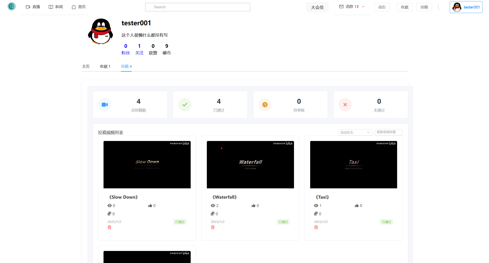

# VideoShare Platform - 基于SpringBoot+Vue3的视频分享平台


## 项目简介

一个类似抖音/B站的视频分享平台，支持用户注册、视频上传与观看、点赞收藏、关注私信等功能。

## 技术栈

### 后端技术
- **核心框架**: Spring Boot 2.7.0
- **数据库**: MySQL + MyBatis
- **缓存**: Redis (用户信息缓存、热门视频统计、消息缓存)
- **存储**: Aliyun OSS (视频、图片等静态资源存储)
- **安全认证**: JWT (验证身份)
- **实时通信**: WebSocket (消息推送、通知系统)
- **视频处理**: javacv (视频压缩、转码)
- **AOP**: 面向切面编程 (业务逻辑解耦)
- **API文档**: SpringDoc OpenAPI

### 前端技术
- Vue 3 (Composition API)
- Element Plus UI组件库
- Axios HTTP客户端
- WebSocket 客户端
- pinia 状态管理

### 部署与运维
- Nginx (前端部署与反向代理)
- 阿里云实例 
- Git 

## 功能特性

### 用户系统
- 用户注册/登录/个人信息管理
- JWT身份验证与授权
- 用户关注/粉丝关系

### 视频功能
- 视频上传与转码处理
- 视频分类与推荐
- 视频播放统计
- 点赞/收藏/投币功能
- 树型评论系统

### 社交功能
- 用户私信系统
- 实时通知系统 (点赞、评论、关注等)
- 消息未读标记


### 核心模块设计
1. **用户服务**: 处理用户认证、个人信息、关注关系
2. **视频服务**: 视频上传、转码、存储、播放统计
3. **互动服务**: 点赞、收藏、评论等交互功能
4. **消息服务**: 实时通知、私信推送
5. **推荐服务**: 基于热门度的视频推荐

## 项目部署

### 环境要求
- JDK 1.8+
- MySQL 5.7+
- Redis 5.0+
- Node.js 18+
- FFmpeg 4.0+

### 后端部署
1. 配置`application.yml`中的数据库和Redis连接
2. 配置阿里云OSS访问密钥
3. 构建并运行:
```bash
mvn clean package
java -jar target/VideoraServer-1.0.jar

```
### 项目体验
- 后端地址 : http://159.75.68.114:8001
- 前端仓库 : https://github.com/J-Bling/Videora.git
- 前端体验 : http://159.75.68.114:80

````



